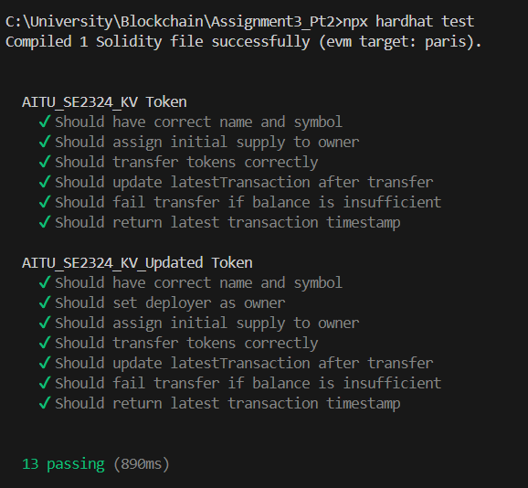

# Assignment 3. Part 2.
## About Task
In previous task I wrote AITU_SE2324_KV contract that is an ERC-20 smart contract.
It just makes the tokens and mints them to the person, who deploys the contract
But in this task I created additional token:

- **AITU_SE2324_KV**: A basic ERC20 token.
- **AITU_SE2324_KV_Upgraded**: Basic ERC20 token that can take in how many tokens contractor wants to mint.

## About Token  
Standard ERC-20 openzeppelin token implementation

Mints initial tokens to owner

Tracks: transaction sender, receiver, amount, and timestamp

Functions: transfer, transferFrom, allowance


## Installation  
1. Clone the repository:  
   ```bash
   git clone https://github.com/milterdole/Assignment3_Pt2.git
   cd Assignment3_Pt2
   ```
2. Install dependencies:  
   ```bash
   npm install
   npm install @openzeppelin/contracts
   ```
3. Hardhat installation:
    ```bash
    npm install --save-dev hardhat
4. Launch tests (all):
    ```bash
    npx hardhat test
    ```

## Demo


This is what you should get if you intalled everything correctly.

If you want to look at code: check files in /Contracts and /test
